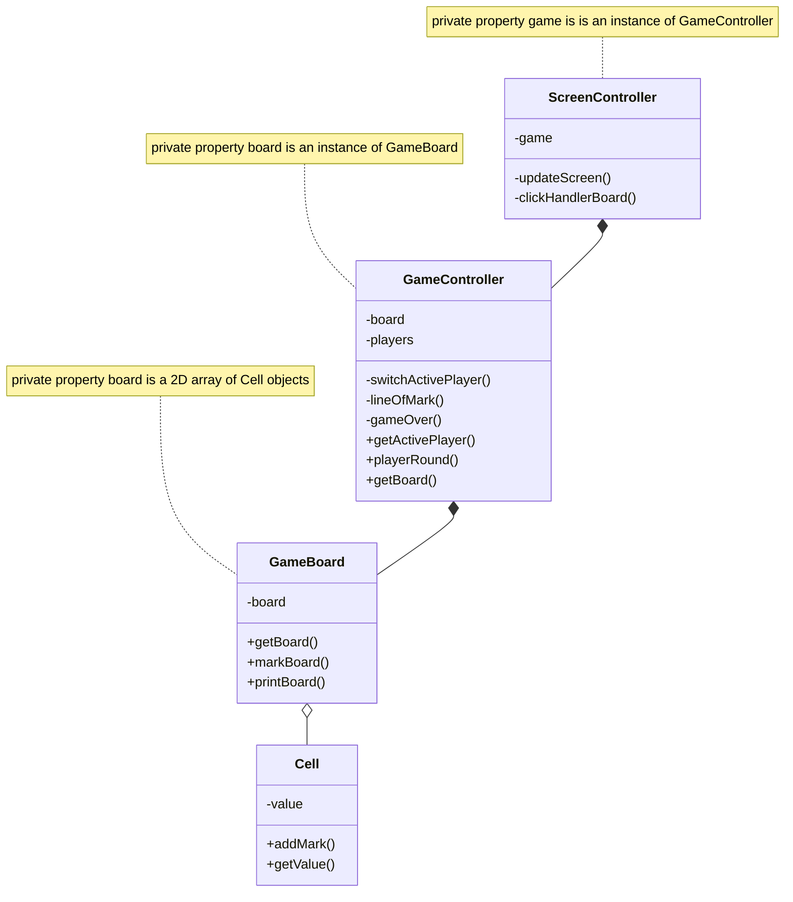

# odin-tic-tac-toe
simple tic  tac toe game with javascript modules and factory funnctions

## development

```mermaid
classDiagram
    GameBoard o-- Cell
    GameController *-- GameBoard
    ScreenController *-- GameController
    class Cell{
        -value
        +addMark()
        +getValue()
    }
    class GameBoard{
        -board
        +getBoard()
        +markBoard()
        +printBoard()
    }
    note for GameBoard "private property board is a 2D array of Cell objects"
    class GameController{
        -board
        -players
        -switchActivePlayer()
        -lineOfMark()
        -gameOver()
        +getActivePlayer()
        +playerRound()
        +getBoard()
    }
    note for GameController "private property board is an instance of GameBoard"
    class ScreenController{
        -game
        -updateScreen()
        -clickHandlerBoard()
    }
    note for ScreenController "private property game is is an instance of GameController"
```

1 factory  function:
- Cell

3 modules:
- GameBoard
- GameController
- ScreenController

